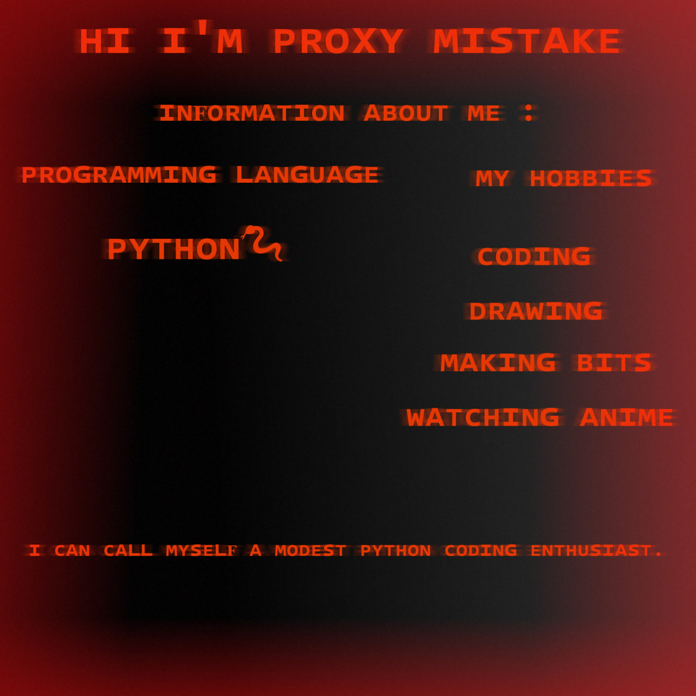

<h1 align = "center">
  
  
</h1>

<h4 align = "center">
  ᴍʏ sᴏᴄɪᴀʟ ɴᴇᴛᴏᴡʀᴋ : 
   
  <a href = "https://t.me/Proxy1Mistake" target="_blank">
  
  <a href = "https://discordapp.com/users/875370793100533862/" target="_blank">
  
   
  

</h4>
    
